# Skill Graph

<!-- learned: 2026-06 | project: cortex-bootstrap | model: index-builder -->

Generated from skill frontmatter. Do not hand-edit skill entries;
update the source skill files and rerun `skills/meta/scripts/index_builder.py`.

## Domains

- `collaboration`: 2 skill(s)
- `devops`: 2 skill(s)
- `forensics`: 2 skill(s)
- `legal`: 4 skill(s)
- `meta`: 8 skill(s)
- `presentation`: 1 skill(s)
- `programming`: 1 skill(s)
- `prompting`: 2 skill(s)
- `security`: 1 skill(s)
- `sql`: 2 skill(s)
- `writing`: 2 skill(s)

## Tags

`articles`, `authoring`, `cache`, `casework`, `client-communication`, `collaboration`, `conflicts`, `containers`, `continuity`, `database`, `deployment`, `devops`, `docker`, `editing`, `evidence`, `fingerprinting`, `forensics`, `handoff`, `html`, `immigration`, `index`, `legal`, `llm`, `longform`, `manifest`, `meta`, `network`, `orchestration`, `performance`, `planning`, `postgres`, `presentation`, `programming`, `prompting`, `protocol`, `python`, `queues`, `redis`, `review`, `roles`, `security`, `skills`, `slides`, `sql`, `strategy`, `testing`, `tooling`, `typing`, `voice`, `writing`

## Skills

| Skill | Status | Model Role | Review | Summary | Tags | Related |
| --- | --- | --- | --- | --- | --- | --- |
| [`collaboration/grill-me`](../../collaboration/grill-me/SKILL.md) | seed | thinking | unreviewed / - | Interview the user one question at a time, starting low fidelity, to stress-test a plan until the design tree is resolved. | collaboration, planning, review | `meta/contributing`, `meta/roles` |
| [`collaboration/handoff`](../../collaboration/handoff/SKILL.md) | seed | thinking | unreviewed / - | Write a redacted project handoff so a fresh agent or developer can continue without duplicating existing artifacts. | collaboration, continuity, handoff | `collaboration/grill-me`, `meta/contributing` |
| [`devops/docker-patterns`](../../devops/docker-patterns/SKILL.md) | seed | reference | human-noted / low | Apply Docker and Docker Compose patterns for local development, service wiring, volumes, and container hardening. | devops, docker, containers, security | `sql/injection`, `meta/contributing` |
| [`devops/redis-patterns`](../../devops/redis-patterns/SKILL.md) | seed | reference | unreviewed / - | Apply Redis patterns for caching, rate limiting, locks, sessions, messaging, and production connection management. | devops, redis, cache, queues, security | `devops/docker-patterns`, `sql/injection`, `meta/contributing` |
| [`forensics/ja4`](../../forensics/ja4/SKILL.md) | seed | reference | unreviewed / - | Interpret JA4-family network fingerprints and avoid common implementation mistakes when working from packet captures or logs. | forensics, network, fingerprinting | `forensics/pcap`, `meta/contributing` |
| [`forensics/pcap`](../../forensics/pcap/SKILL.md) | seed | reference | unreviewed / - | Preserve original packet captures and analyze derived copies for network-forensics artifacts, anomalies, and evidence. | forensics, network, evidence | `forensics/ja4`, `meta/contributing` |
| [`legal/immigration-case-summary`](../../legal/immigration-case-summary/SKILL.md) | seed | thinking | unreviewed / - | Draft attorney-facing immigration case summaries from client facts, procedural history, status, risk flags, and next steps. | legal, immigration, writing, casework | `legal/immigration-client-letter`, `legal/immigration-rfe-response`, `legal/immigration-visa-brief`, `writing/humanizer` |
| [`legal/immigration-client-letter`](../../legal/immigration-client-letter/SKILL.md) | seed | thinking | unreviewed / - | Draft plain-language immigration client letters and emails that explain case developments, next steps, and deadlines. | legal, immigration, writing, client-communication | `legal/immigration-case-summary`, `legal/immigration-rfe-response`, `legal/immigration-visa-brief`, `writing/humanizer` |
| [`legal/immigration-rfe-response`](../../legal/immigration-rfe-response/SKILL.md) | seed | thinking | unreviewed / - | Draft USCIS RFE, RFIE, and NOID response frameworks with issue maps, attorney briefs, exhibit lists, and evidence gaps. | legal, immigration, writing, evidence | `legal/immigration-case-summary`, `legal/immigration-client-letter`, `legal/immigration-visa-brief`, `writing/article-writing` |
| [`legal/immigration-visa-brief`](../../legal/immigration-visa-brief/SKILL.md) | seed | thinking | unreviewed / - | Draft immigration visa option and strategy briefs that compare candidate categories, risks, timelines, and next steps. | legal, immigration, writing, strategy | `legal/immigration-case-summary`, `legal/immigration-client-letter`, `legal/immigration-rfe-response`, `writing/article-writing` |
| [`meta/conflicts`](../conflicts/SKILL.md) | seed | thinking | unreviewed / - | Append-only log for unresolved contradictions found while updating vault skills. | meta, conflicts | `meta/index`, `meta/roles` |
| [`meta/contributing`](../contributing/SKILL.md) | active | thinking | human-noted / high | Protocol for deciding what belongs in the vault, how to update it, and how model roles are separated. | meta, protocol | `meta/index`, `meta/roles`, `meta/conflicts`, `meta/deployment`, `meta/source-manifest`, `meta/skill-authoring` |
| [`meta/deployment`](../deployment/SKILL.md) | seed | execution | unreviewed / - | Deploy Cortex skills as managed native wrappers while preserving the vault as the source of truth. | meta, deployment | `meta/roles`, `meta/orchestration`, `meta/source-manifest` |
| [`meta/index`](SKILL.md) | seed | reference | unreviewed / - | Generated map of vault skills, domains, summaries, and relationships. | meta, index | `meta/roles` |
| [`meta/orchestration`](../orchestration/SKILL.md) | seed | thinking | unreviewed / - | Coordinate a boss agent that spawns specialized worker subagents and loops them until explicit completion criteria are met. | meta, orchestration | `meta/roles`, `meta/deployment`, `meta/skill-authoring` |
| [`meta/roles`](../roles/SKILL.md) | seed | thinking | unreviewed / - | Defines the strict split between thinking models that decide and execution models that format, lint, and commit. | meta, roles | `meta/index`, `meta/conflicts`, `meta/deployment`, `meta/source-manifest` |
| [`meta/skill-authoring`](../skill-authoring/SKILL.md) | seed | thinking | unreviewed / - | Draft Cortex skills after contribution triage, using concise triggers, concrete workflows, and deterministic resources. | meta, authoring, skills | `meta/index`, `meta/orchestration`, `meta/roles` |
| [`meta/source-manifest`](../source-manifest/SKILL.md) | seed | reference | unreviewed / - | Generated manifest of vault notes, scripts, root files, logs, and basic counts. | meta, manifest | `meta/index` |
| [`presentation/frontend-slides`](../../presentation/frontend-slides/SKILL.md) | seed | thinking | unreviewed / - | Create polished offline-capable HTML slide decks from a brief, existing content, or PowerPoint source using vendored frontend slide templates. | presentation, slides, html | `writing/humanizer`, `meta/deployment` |
| [`programming/python-patterns`](../../programming/python-patterns/SKILL.md) | seed | reference | unreviewed / - | Apply idiomatic Python patterns for readable code, type hints, error handling, package layout, tooling, and performance. | programming, python, typing, testing, tooling | `sql/injection`, `meta/contributing` |
| [`prompting/optimize`](../../prompting/optimize/SKILL.md) | seed | thinking | unreviewed / - | Orchestrate a critic, rewriter, and evaluator to turn a draft prompt into a measurably stronger one against a fixed checklist and rubric. | prompting, orchestration | `meta/orchestration`, `prompting/patterns`, `writing/article-writing` |
| [`prompting/patterns`](../../prompting/patterns/SKILL.md) | seed | reference | unreviewed / - | Build and score effective prompts from a fixed component checklist, a pattern catalog, and an anchored quality rubric. | prompting, llm | `writing/article-writing` |
| [`security/review`](../../security/review/SKILL.md) | seed | thinking | unreviewed / - | Orchestrate a network-security review: a research worker analyzes the evidence and a report worker writes the findings, looped until complete. | security, orchestration | `meta/orchestration`, `forensics/pcap`, `forensics/ja4`, `writing/article-writing` |
| [`sql/injection`](../../sql/injection/SKILL.md) | seed | reference | unreviewed / - | Use parameterized SQL query patterns and avoid string-built query text for untrusted values. | sql, security | `meta/contributing` |
| [`sql/postgres-patterns`](../../sql/postgres-patterns/SKILL.md) | seed | reference | unreviewed / - | Apply PostgreSQL patterns for schema design, indexes, query optimization, RLS, connection safety, and operational diagnostics. | sql, postgres, database, performance, security | `devops/docker-patterns`, `devops/redis-patterns`, `programming/python-patterns`, `meta/contributing` |
| [`writing/article-writing`](../../writing/article-writing/SKILL.md) | seed | thinking | unreviewed / - | Draft and revise long-form articles, guides, essays, tutorials, and newsletters with structure, evidence, and voice discipline. | writing, articles, longform, voice, editing | `writing/humanizer`, `collaboration/grill-me`, `meta/skill-authoring` |
| [`writing/humanizer`](../../writing/humanizer/SKILL.md) | seed | thinking | unreviewed / - | Rewrite AI-shaped prose into clearer human-facing writing while preserving meaning, facts, and the author's intended voice. | writing, editing, voice | `collaboration/handoff`, `meta/skill-authoring` |

## Relationship Graph

```mermaid
flowchart LR
  s_collaboration_grill_me["collaboration/grill-me"]
  s_collaboration_handoff["collaboration/handoff"]
  s_devops_docker_patterns["devops/docker-patterns"]
  s_devops_redis_patterns["devops/redis-patterns"]
  s_forensics_ja4["forensics/ja4"]
  s_forensics_pcap["forensics/pcap"]
  s_legal_immigration_case_summary["legal/immigration-case-summary"]
  s_legal_immigration_client_letter["legal/immigration-client-letter"]
  s_legal_immigration_rfe_response["legal/immigration-rfe-response"]
  s_legal_immigration_visa_brief["legal/immigration-visa-brief"]
  s_meta_conflicts["meta/conflicts"]
  s_meta_contributing["meta/contributing"]
  s_meta_deployment["meta/deployment"]
  s_meta_index["meta/index"]
  s_meta_orchestration["meta/orchestration"]
  s_meta_roles["meta/roles"]
  s_meta_skill_authoring["meta/skill-authoring"]
  s_meta_source_manifest["meta/source-manifest"]
  s_presentation_frontend_slides["presentation/frontend-slides"]
  s_programming_python_patterns["programming/python-patterns"]
  s_prompting_optimize["prompting/optimize"]
  s_prompting_patterns["prompting/patterns"]
  s_security_review["security/review"]
  s_sql_injection["sql/injection"]
  s_sql_postgres_patterns["sql/postgres-patterns"]
  s_writing_article_writing["writing/article-writing"]
  s_writing_humanizer["writing/humanizer"]
  s_collaboration_grill_me -.-> s_meta_contributing
  s_collaboration_grill_me -.-> s_meta_roles
  s_collaboration_handoff -.-> s_collaboration_grill_me
  s_collaboration_handoff -.-> s_meta_contributing
  s_devops_docker_patterns -.-> s_sql_injection
  s_devops_docker_patterns -.-> s_meta_contributing
  s_devops_redis_patterns -.-> s_devops_docker_patterns
  s_devops_redis_patterns -.-> s_sql_injection
  s_devops_redis_patterns -.-> s_meta_contributing
  s_forensics_ja4 -.-> s_forensics_pcap
  s_forensics_ja4 -.-> s_meta_contributing
  s_forensics_pcap -.-> s_forensics_ja4
  s_forensics_pcap -.-> s_meta_contributing
  s_legal_immigration_case_summary --> s_meta_contributing
  s_legal_immigration_case_summary -.-> s_legal_immigration_client_letter
  s_legal_immigration_case_summary -.-> s_legal_immigration_rfe_response
  s_legal_immigration_case_summary -.-> s_legal_immigration_visa_brief
  s_legal_immigration_case_summary -.-> s_writing_humanizer
  s_legal_immigration_client_letter --> s_meta_contributing
  s_legal_immigration_client_letter -.-> s_legal_immigration_case_summary
  s_legal_immigration_client_letter -.-> s_legal_immigration_rfe_response
  s_legal_immigration_client_letter -.-> s_legal_immigration_visa_brief
  s_legal_immigration_client_letter -.-> s_writing_humanizer
  s_legal_immigration_rfe_response --> s_meta_contributing
  s_legal_immigration_rfe_response -.-> s_legal_immigration_case_summary
  s_legal_immigration_rfe_response -.-> s_legal_immigration_client_letter
  s_legal_immigration_rfe_response -.-> s_legal_immigration_visa_brief
  s_legal_immigration_rfe_response -.-> s_writing_article_writing
  s_legal_immigration_visa_brief --> s_meta_contributing
  s_legal_immigration_visa_brief -.-> s_legal_immigration_case_summary
  s_legal_immigration_visa_brief -.-> s_legal_immigration_client_letter
  s_legal_immigration_visa_brief -.-> s_legal_immigration_rfe_response
  s_legal_immigration_visa_brief -.-> s_writing_article_writing
  s_meta_conflicts --> s_meta_contributing
  s_meta_conflicts -.-> s_meta_index
  s_meta_conflicts -.-> s_meta_roles
  s_meta_contributing -.-> s_meta_index
  s_meta_contributing -.-> s_meta_roles
  s_meta_contributing -.-> s_meta_conflicts
  s_meta_contributing -.-> s_meta_deployment
  s_meta_contributing -.-> s_meta_source_manifest
  s_meta_contributing -.-> s_meta_skill_authoring
  s_meta_deployment --> s_meta_contributing
  s_meta_deployment --> s_meta_index
  s_meta_deployment -.-> s_meta_roles
  s_meta_deployment -.-> s_meta_orchestration
  s_meta_deployment -.-> s_meta_source_manifest
  s_meta_index --> s_meta_contributing
  s_meta_index -.-> s_meta_roles
  s_meta_orchestration --> s_meta_roles
  s_meta_orchestration -.-> s_meta_roles
  s_meta_orchestration -.-> s_meta_deployment
  s_meta_orchestration -.-> s_meta_skill_authoring
  s_meta_roles --> s_meta_contributing
  s_meta_roles -.-> s_meta_index
  s_meta_roles -.-> s_meta_conflicts
  s_meta_roles -.-> s_meta_deployment
  s_meta_roles -.-> s_meta_source_manifest
  s_meta_skill_authoring --> s_meta_contributing
  s_meta_skill_authoring -.-> s_meta_index
  s_meta_skill_authoring -.-> s_meta_orchestration
  s_meta_skill_authoring -.-> s_meta_roles
  s_meta_source_manifest --> s_meta_contributing
  s_meta_source_manifest -.-> s_meta_index
  s_presentation_frontend_slides --> s_meta_contributing
  s_presentation_frontend_slides -.-> s_writing_humanizer
  s_presentation_frontend_slides -.-> s_meta_deployment
  s_programming_python_patterns -.-> s_sql_injection
  s_programming_python_patterns -.-> s_meta_contributing
  s_prompting_optimize --> s_meta_orchestration
  s_prompting_optimize --> s_prompting_patterns
  s_prompting_optimize -.-> s_meta_orchestration
  s_prompting_optimize -.-> s_prompting_patterns
  s_prompting_optimize -.-> s_writing_article_writing
  s_prompting_patterns -.-> s_writing_article_writing
  s_security_review --> s_meta_orchestration
  s_security_review -.-> s_meta_orchestration
  s_security_review -.-> s_forensics_pcap
  s_security_review -.-> s_forensics_ja4
  s_security_review -.-> s_writing_article_writing
  s_sql_injection -.-> s_meta_contributing
  s_sql_postgres_patterns --> s_sql_injection
  s_sql_postgres_patterns -.-> s_devops_docker_patterns
  s_sql_postgres_patterns -.-> s_devops_redis_patterns
  s_sql_postgres_patterns -.-> s_programming_python_patterns
  s_sql_postgres_patterns -.-> s_meta_contributing
  s_writing_article_writing --> s_meta_contributing
  s_writing_article_writing -.-> s_writing_humanizer
  s_writing_article_writing -.-> s_collaboration_grill_me
  s_writing_article_writing -.-> s_meta_skill_authoring
  s_writing_humanizer --> s_meta_contributing
  s_writing_humanizer -.-> s_collaboration_handoff
  s_writing_humanizer -.-> s_meta_skill_authoring
```

